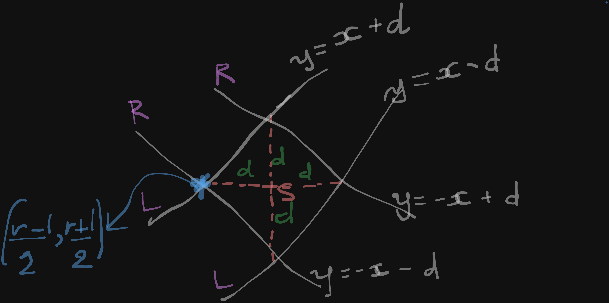

## Math explaination for part 2

Each source S with coordinate (Sx,Sy) has 4 points (i.e: upper, lower, right, left) that is d Manhattan units away from it.

These 4 points form 4 lines with form x=ax+b:
 
- 2 lines are tilted to the Right(i.e: R) with a=-1, b=d(upper bound) and b=-d (lower bound)
- 2 lines are tilted to the Left(i.e: R) with a=-1, b=d(upper bound) and b=-d (lower bound)

By finding the line equations for the 4 lines above, we'll be able to figure out their meeting points. 

The question is to find a beacon that is outside of the Source radar, which means anything that is further away from S with distance d+1 would not be in the zone.

